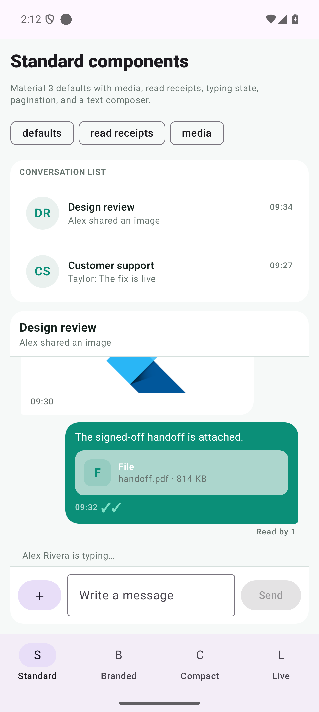
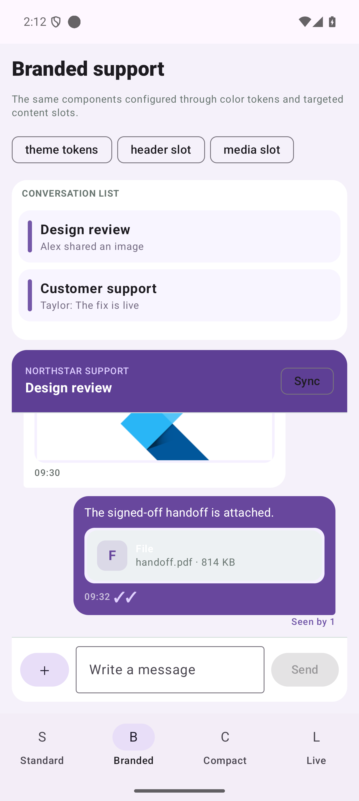
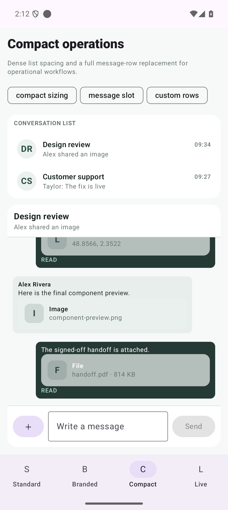

# ConvoKit Android UI examples

A public native Android application showing how to use the compiled
`app.convokit:convokit-android-ui` Jetpack Compose package from
<https://maven.convokit.app>.

This repository contains demo integration code only. The reusable UI package
implementation stays in its private source repository.

## Component configurations

| Standard components | Branded support | Compact operations |
| --- | --- | --- |
|  |  |  |

The app includes four navigable examples:

- **Standard** uses the Material 3 defaults with media, read receipts, typing,
  pagination, and the composer.
- **Branded** applies a custom palette and replaces the list row, header, media
  wrapper, read receipt, and composer styling.
- **Compact** changes sizing tokens and replaces the complete message row.
- **Live** connects the real SDK, joins a room through an application backend,
  and renders the SDK-backed conversation component.

## Run

Open the repository in Android Studio and run the `app` configuration, or:

```bash
./gradlew :app:installDebug
```

The debug APK is generated at `app/build/outputs/apk/debug/app-debug.apk`.

## Package setup

The project resolves the private implementation's compiled artifacts from the
public, unauthenticated ConvoKit Maven feed:

```kotlin
dependencyResolutionManagement {
    repositories {
        google()
        mavenCentral()
        maven("https://maven.convokit.app/")
    }
}

dependencies {
    implementation("app.convokit:convokit-android-ui:0.1.2")
}
```

The UI artifact exposes the compatible core SDK transitively. An application
may also declare `app.convokit:convokit-android:0.1.1` explicitly.

## Live room example

The checked-in defaults use the deliberately open ConvoKit demo broker at
<https://convokit-open-chatroom.vercel.app>. Enter a unique demo user ID and an
existing room ID. The broker grants demo membership and returns the short-lived
token used by the Android SDK.

Joining by room ID is intentionally application/backend logic, not a UI SDK
component. Real products must decide who is allowed to join, how invite codes
map to rooms, and how their users are authenticated. Once authorized, render:

```kotlin
ConvoKitConversation(
    client = DefaultConvoKitUiClient(connectedSdk),
    conversationId = joinedRoomId,
)
```

The client ID is public. Never put a ConvoKit client secret in an APK,
`BuildConfig`, resource, manifest, or mobile request. Production token endpoints
must authenticate the host application's user and derive the app-user ID on the
server.

## Documentation

See the [Android UI documentation](https://convokit.app/docs/android-ui) and
[native Android SDK documentation](https://convokit.app/docs/android-sdk).
